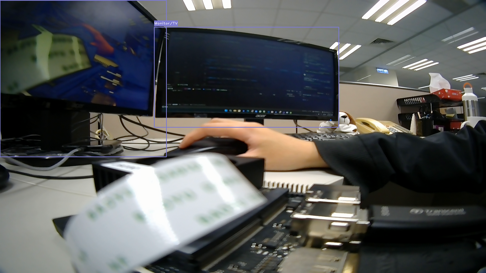
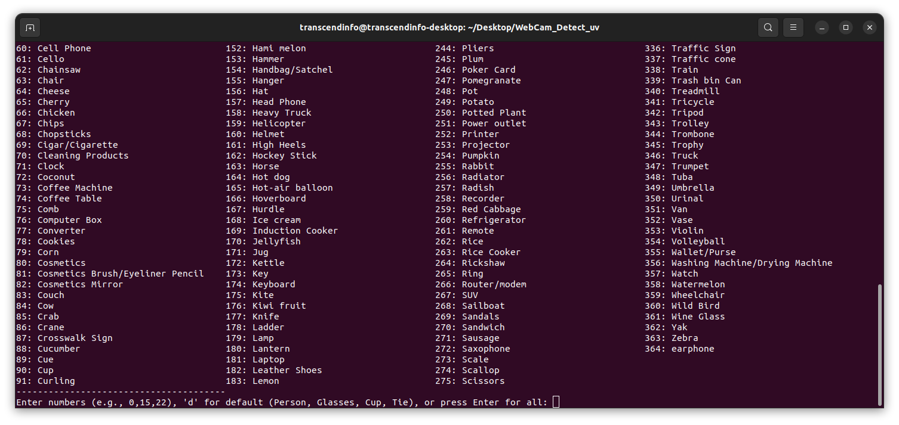

# Transcend ECM300 Jetson Object Detection Demo
This project demonstrates real-time Object Detection on the **NVIDIA Jetson ORIN Nano** platform, using the **Transcend ECM300** embedded camera module.




---

## Table of Contents

* [Hardware Requirements](#hardware-requirements)
* [Install NVIDIA Jetson Nano OS](#install-nvidia-jetson-nano-os)
* [Download Virtual Environment](#download-virtual-environment)
* [Connect the ECM300 Camera](#connect-the-ecm300-camera-to-jetson-orin-nano)
* [Quicky Run Object Detect](#quicky-run-object-detect)
* [Set Up Virtual Environment](#set-up-a-virtual-environment)
* [Run Object Detect](#run-object-detect)
* [Third-Party Licenses](#third-party-licenses)

---

## Hardware Requirements

1. **Supported Platforms**

   * NVIDIA Jetson ORIN Nano

2. **Supported Cameras**

   * [Transcend ECM300](https://www.transcend-info.com/embedded/product/embedded-camera-modules/ecm-300)

3. **Recommended SD Card**

   * A microSD card with at least **128 GB** capacity and **UHS-1** speed class.

---

## Install NVIDIA Jetson Nano OS

1. Download the **Jetson Nano Developer Kit SD Card Image** from https://s3.ap-northeast-1.amazonaws.com/test.storejetcloud.com/ECM300+Image/ecm300_jetpack.zip
2. Write the image to the target microSD card using a graphical tool such as [Balena Etcher](https://etcher.balena.io/).
3. Once the image has been written, insert the microSD card into the Jetson’s native slot and power on the device.
4. The default login username and password are both “user”.

---

## Download Virtual Environment

1. Download the **Virtual Environment** from https://s3.ap-northeast-1.amazonaws.com/test.storejetcloud.com/ECM300+Image/object_detect_demo_venv.zip
2. Unzip the downloaded ZIP file.
3. Copy the extracted **object_detect_demo_venv** folder to the desktop.

---
---

## Connect the ECM300 Camera to Jetson ORIN Nano

1. Insert the camera module as follows:
  - **ECM300**, insert into the **CAM1** port.

2. Open a terminal and run:

   ```bash
   cd /opt/nvidia/jetson-io
   sudo python jetson-io.py
   ```

3. In the configuration menu, select the following options in order:

   * “Configure Jetson 24pin CSI Connector”
   * “Configure for compatible hardware”
   * Select “Camera IMX675-C”
   * “Save pin changes”
   * “Save and reboot to recognize pins”

4. After rebooting, verify that the camera is connected:

   ```bash
   ls /dev/video*
   ```

5. If **/dev/video0** appears, the ECM300 has been successfully connected.

---

## Quicky Run Object Detect

### 1. Run the Script run_webcam.sh
```bash
cd Desktop/object_detect_demo_venv
./run_webcam.sh
```

### 2. Choose the Detection Classes
When prompted, select the desired object classes, or enter 'd' to use the default list.


Press 'q' to exit fullscreen mode.

---

## Set Up a Virtual Environment

```bash
cd Desktop/object_detect_demo_venv
source .venv/bin/activate
```

To deactivate the virtual environment:

```bash
deactivate
```

---

## Run Object Detect

### 1.Set Up a Virtual Camera 
```bash
sudo modprobe v4l2loopback devices=1 video_nr=10 card_label="VirtualCam" exclusive_caps=1
```

### 2.Start the GStreamer Pipeline
```bash
echo "Starting GStreamer camera pipeline in the background..."
gst-launch-1.0 nvarguscamerasrc ! 'video/x-raw(memory:NVMM),width=1920,height=1080,format=NV12,framerate=30/1' ! nvvidconv ! 'video/x-raw, format=I420' ! videoconvert ! 'video/x-raw, format=BGR' ! v4l2sink device=/dev/video10
```

### 3.Run the YOLO detection script
```bash
python webcam_yolo.py
```

Press 'q' to exit fullscreen mode.

---

## Third-Party Licenses

This project uses [NRtred/yolo11n_object365](https://huggingface.co/NRtred/yolo11n_object365), which is licensed under the MIT License.
All third-party license details are stored in the Third-Party Licenses/ directory for reference.
